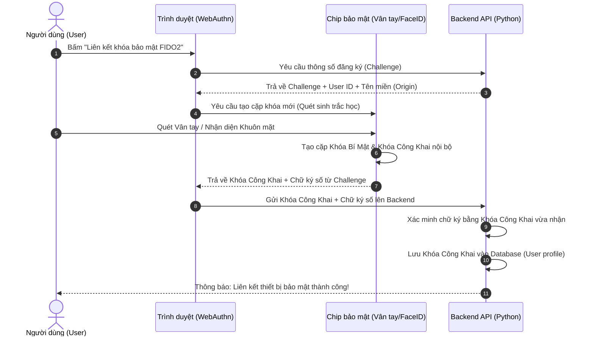
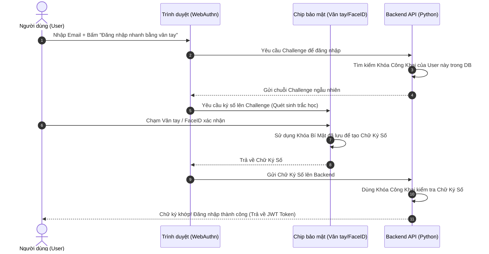

# HƯỚNG DẪN HỌC TẬP: XÁC THỰC ĐA YẾU TỐ (MFA) VỚI TIÊU CHUẨN FIDO2

Tài liệu này tổng hợp toàn bộ kiến thức cốt lõi về xác thực đa yếu tố (MFA) sử dụng công nghệ FIDO/WebAuthn, cơ chế hoạt động, lợi ích bảo mật và cách ứng dụng thực tế trong hệ thống của chúng ta.

---

## 1. Các Khái Niệm Cơ Bản

### 1.1 FIDO là gì?
*   **FIDO (Fast Identity Online):** Là một liên minh công nghệ mở (gồm Apple, Google, Microsoft, Yubico, Samsung...) được thành lập nhằm tạo ra các tiêu chuẩn xác thực an toàn hơn, thay thế mật khẩu truyền thống.
*   **FIDO2:** Là phiên bản mới nhất, cho phép các thiết bị phổ thông (điện thoại, laptop) đóng vai trò làm thiết bị xác thực thông qua trình duyệt web mà không cần cài đặt thêm phần mềm.

### 1.2 Cấu phần của FIDO2
FIDO2 được tạo thành từ hai thành phần chính:
1.  **WebAuthn (Web Authentication):** API chạy trên trình duyệt (Javascript) giúp website giao tiếp với thiết bị xác thực phần cứng của người dùng.
2.  **CTAP (Client to Authenticator Protocol):** Giao thức cho phép thiết bị ngoại vi (như khóa bảo mật Yubikey qua USB/NFC hoặc Bluetooth) kết nối và nói chuyện với máy tính/điện thoại.

---

## 2. Cơ Chế Hoạt Động (Mật Mã Học Khóa Công Khai)

FIDO2 loại bỏ hoàn toàn việc lưu mật khẩu trên server. Thay vào đó, nó sử dụng **cặp khóa mật mã bất đối xứng (Asymmetric Keys)**:

| Thành phần | Nơi lưu trữ | Nhiệm vụ |
| :--- | :--- | :--- |
| **Khóa công khai (Public Key)** | Lưu trên Server DB | Sử dụng để kiểm tra chữ ký số gửi lên từ người dùng. Không cần bảo mật nghiêm ngặt. |
| **Khóa bí mật (Private Key)** | Lưu trên chip bảo mật của thiết bị (TPM/Secure Enclave) | Sử dụng để ký số xác nhận danh tính. **Tuyệt đối không bao giờ rời khỏi thiết bị**. |

---

## 3. Quy Trình Xác Thực (Flow Diagrams)

### 3.1 Quy trình Đăng ký Thiết bị (Registration Flow)

---

### 3.2 Quy trình Đăng nhập (Authentication Flow)

---

## 4. Tại Sao FIDO Lại An Toàn Vượt Trội?

### 4.1 Khả năng Chống Phishing (Giả mạo) Tuyệt Đối
*   **MFA truyền thống (SMS OTP, Google Authenticator):** Vẫn bị giả mạo. Khi bạn vào một trang web nhái (ví dụ: `conveniastore-fake.com`), bạn nhập mã OTP, hacker sẽ dùng mã đó để đăng nhập vào trang thật.
*   **FIDO2:** Trình duyệt tự động đính kèm thông tin **tên miền (Origin)** khi ký số. Khóa tạo cho domain `conveniastore.vercel.app` sẽ không bao giờ hoạt động trên domain `conveniastore-fake.com`. Dù người dùng có bị lừa quét vân tay, chữ ký số gửi lên cũng bị server thật từ chối vì sai domain nguồn.

### 4.2 Không Sợ Rò Rỉ Dữ Liệu Server (No Shared Secrets)
*   Hệ thống không lưu trữ mật khẩu hay khóa bí mật của người dùng. Server chỉ lưu **Khóa công khai**.
*   Nếu hacker hack thành công vào database của server, chúng cũng không thể lấy được khóa bí mật để đăng nhập giả mạo, vì khóa bí mật nằm an toàn trong chip điện thoại/máy tính của bạn.

---

## 5. Ứng Dụng Thực Tế Trong Dự Án (Convenia Store)

Hệ thống của chúng ta áp dụng xác thực FIDO như một yếu tố bảo mật thứ hai (MFA) hoặc xác thực thay thế mật khẩu (Passwordless):

1.  **Frontend (`frontend/src/pages/Profile.jsx`):**
    *   Gọi hàm API trình duyệt `navigator.credentials.create()` để yêu cầu hệ điều hành mở cửa sổ TouchID/FaceID đăng ký.
    *   Gọi hàm `navigator.credentials.get()` khi đăng nhập.
2.  **Backend (`backend/main.py`):**
    *   Tạo chuỗi `challenge` ngẫu nhiên lưu tạm.
    *   Xác minh chữ ký số nhận được bằng thư viện tiền mã hóa trước khi xác nhận lưu khóa hoặc cho phép đăng nhập.

---

## 6. Tóm Tắt Ghi Nhớ Nhanh (Cheat-sheet đi thi/phỏng vấn)

*   **FIDO = Fast Identity Online**: Chuẩn xác thực không mật khẩu, chống phishing.
*   **Asymmetric Cryptography**: Dựa trên cặp khóa (Khóa công khai trên Server, Khóa bí mật trong Chip thiết bị).
*   **Origin Binding**: Khóa bảo mật bị ràng buộc chặt chẽ với tên miền web, ngăn chặn hoàn toàn tấn công Phishing.
*   **MFA 2-trong-1**: Thỏa mãn cả yếu tố "Thiết bị vật lý" (Sở hữu) và "Sinh trắc học" (Đặc điểm cơ thể) chỉ trong một lần xác nhận vân tay/khuôn mặt.
