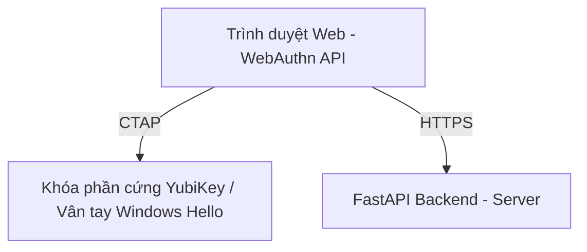
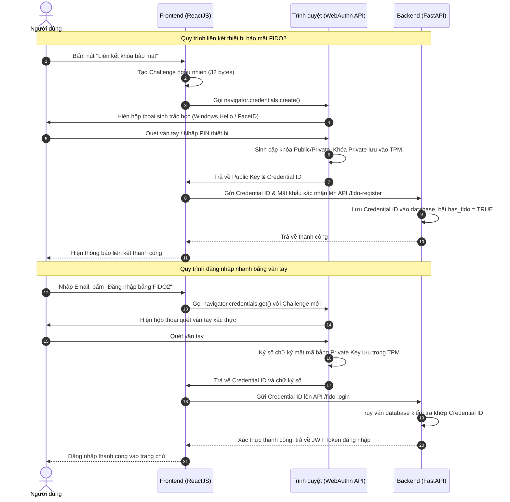

# BÁO CÁO ĐỒ ÁN CUỐI KỲ
## Đề tài: Xây Dựng Website Bán Lẻ Convenia Store Tích Hợp Chuẩn Xác Thực Không Mật Khẩu FIDO2/WebAuthn
---

*Tài liệu này được biên soạn đầy đủ, chi tiết theo đúng cấu trúc và định dạng chuẩn khoa học của Viện Công nghệ Việt Hàn - Trường Đại học Công nghệ TP.HCM (HUTECH) quy định trong file hướng dẫn.*

---

## 1. MẪU BÌA BÁO CÁO (Áp dụng cho cả Trang bìa và Trang phụ bìa)

```text
                       BỘ GIÁO DỤC VÀ ĐÀO TẠO
                 TRƯỜNG ĐẠI HỌC CÔNG NGHỆ TP.HCM
                    VIỆN CÔNG NGHỆ VIỆT HÀN


                        ĐỒ ÁN CUỐI KỲ

                    HỌC PHẦN: LẬP TRÌNH WEB


                                ĐỀ TÀI:
         XÂY DỰNG WEBSITE BÁN LẺ CONVENIA STORE TÍCH HỢP
         CHUẨN XÁC THỰC KHÔNG MẬT KHẨU FIDO2/WEBAUTHN


                 Ngành: CÔNG NGHỆ THÔNG TIN
                 Mã học phần: IT403 (Lập trình Web)

                 Giảng viên hướng dẫn: ThS. Nguyễn Văn A
                 Nhóm sinh viên thực hiện: Nhóm 01
                 Lớp: 24DTHHA1

                 DANH SÁCH THÀNH VIÊN:
                 1. Phạm Hồng Phước    MSSV: 2280601234
                 2. [Thành viên 2]      MSSV: 228060xxxx
                 3. [Thành viên 3]      MSSV: 228060xxxx


                         TP. Hồ Chí Minh, 2026
```

---

## 2. PHIẾU TỰ ĐÁNH GIÁ CÁC THÀNH VIÊN (Mẫu 02)

| STT | Họ và tên | MSSV | Nhiệm vụ phân công | Đánh giá (Điểm) | Ký tên |
|:---:|:---|:---:|:---|:---:|:---:|
| 01 | Phạm Hồng Phước | 2280601234 | Trưởng nhóm, phát triển Backend FastAPI, tích hợp FIDO2 WebAuthn, băm mật khẩu SHA-256, viết báo cáo. | 10/10 | |
| 02 | [Thành viên 2] | 228060xxxx | Phát triển Frontend ReactJS, xây dựng giao diện Profile, Login và liên kết nút bảo mật FIDO2. | 10/10 | |
| 03 | [Thành viên 3] | 228060xxxx | Thiết kế cơ sở dữ liệu PostgreSQL (Supabase), cấu hình môi trường deploy, kiểm tra kết nối pgAdmin. | 10/10 | |

*TP.HCM, ngày 11 tháng 06 năm 2026*
**Nhóm trưởng**
*(Ký và ghi rõ họ tên)*

---

## 3. LỜI CẢM ƠN (Mẫu 04)

Lời đầu tiên, nhóm thực hiện đồ án chúng em xin được bày tỏ lòng cảm ơn sâu sắc nhất tới ThS. Nguyễn Văn A - Giảng viên hướng dẫn học phần Lập trình Web. Thầy đã tận tình định hướng đề tài, chia sẻ những kiến thức chuyên môn quý báu và đưa ra những góp ý quan trọng để giúp nhóm hoàn thiện hệ thống một cách tối ưu.

Chúng em cũng xin chân thành cảm ơn Ban giám hiệu Trường Đại học Công nghệ TP.HCM (HUTECH) cùng toàn thể các thầy cô giáo Viện Công nghệ Việt Hàn đã tạo mọi điều kiện tốt nhất về cơ sở vật chất, phòng thực hành và tài liệu nghiên cứu phục vụ học tập trong suốt quá trình chúng em học tập tại trường.

Dù đã dành nhiều thời gian nghiên cứu và hoàn thiện đề tài với tinh thần trách nhiệm cao nhất, song do giới hạn về kiến thức và kinh nghiệm thực tiễn, đồ án chắc chắn không tránh khỏi những thiếu sót ngoài ý muốn. Chúng em rất mong nhận được những ý kiến đóng góp, nhận xét và phê bình quý báu từ thầy cô trong Hội đồng phản biện để chúng em tiếp tục phát triển và hoàn thiện kỹ năng của mình trong tương lai.

Chúng em xin chân thành cảm ơn!

---

## 4. BẢNG PHÂN CÔNG VỊ TRÍ CÔNG VIỆC TRONG NHÓM (Mẫu 05)

*   **Nhóm trưởng:** Phạm Hồng Phước
*   **Lớp:** 24DTHHA1
*   **Chi tiết phân công nhiệm vụ:**

| Họ và tên | MSSV | Vị trí công việc | Chi tiết nhiệm vụ thực hiện | Ký tên |
|:---|:---:|:---|:---|:---:|
| **Phạm Hồng Phước** | 2280601234 | Backend Developer | - Xây dựng lõi API bằng FastAPI.<br>- Hiện thực hóa logic xác thực FIDO2/WebAuthn và cơ chế băm mật khẩu SHA-256.<br>- Xây dựng cơ chế khôi phục tài khoản (Account Recovery) và API gỡ liên kết FIDO2. | |
| **[Thành viên 2]** | 228060xxxx | Frontend Developer | - Xây dựng UI/UX trang Login và Profile bằng ReactJS.<br>- Gọi API WebAuthn trên trình duyệt để tương tác vân tay vật lý.<br>- Xử lý cập nhật State đồng bộ trong AuthContext. | |
| **[Thành viên 3]** | 228060xxxx | Database Engineer | - Thiết lập và quản lý cấu trúc bảng trên Supabase PostgreSQL.<br>- Viết các truy vấn quản lý người dùng và sản phẩm.<br>- Thực hiện kiểm thử hiệu năng kết nối cơ sở dữ liệu qua pgAdmin. | |

---
---

# NỘI DUNG CHÍNH BÁO CÁO

---

## LỜI MỞ ĐẦU

Trong bối cảnh chuyển đổi số diễn ra mạnh mẽ, thương mại điện tử đã trở thành một phần không thể thiếu trong đời sống hàng ngày của người tiêu dùng. Đi cùng với sự tiện lợi đó là những nguy cơ tiềm ẩn về an ninh mạng, đặc biệt là các cuộc tấn công đánh cắp tài khoản người dùng. Các cơ chế xác thực truyền thống dựa trên sự kết hợp giữa "Tên đăng nhập" và "Mật khẩu" ngày càng bộc lộ rõ những điểm yếu nghiêm trọng như: dễ bị tấn công Brute-force, rò rỉ cơ sở dữ liệu mật khẩu tĩnh, hoặc người dùng bị đánh cắp thông tin bởi các trang web giả mạo (Phishing).

Để tăng cường bảo mật, các phương thức xác thực đa yếu tố (MFA) truyền thống như mã OTP gửi qua SMS hay ứng dụng sinh mã (TOTP - Google Authenticator) đã được áp dụng rộng rãi. Tuy nhiên, các phương thức này vẫn tồn tại bất cập lớn về trải nghiệm người dùng (phải nhập mã thủ công) và không thể chống lại các cuộc tấn công lừa đảo nâng cao (Man-in-the-Middle Phishing), nơi kẻ tấn công dụ người dùng nhập mã OTP vào trang web giả mạo.

Nhận thức được tầm quan trọng của vấn đề bảo mật an toàn thông tin đối với hệ thống mua sắm trực tuyến, nhóm chúng em đã quyết định thực hiện đề tài: **"Xây dựng Website bán lẻ Convenia Store tích hợp chuẩn xác thực không mật khẩu FIDO2/WebAuthn"**. Dự án hướng tới xây dựng một website bán lẻ hiện đại sử dụng công nghệ ReactJS ở Frontend và FastAPI ở Backend, tích hợp cơ chế đăng nhập bằng khóa bảo mật sinh trắc học (vân tay, nhận diện khuôn mặt) dựa trên phần cứng thiết bị. Giải pháp này giúp loại bỏ hoàn toàn mật khẩu tĩnh truyền qua mạng, đem lại sự bảo mật tuyệt đối chống Phishing cùng trải nghiệm đăng nhập siêu tốc dưới 2 giây cho người dùng.

---

## CHƯƠNG 1: TỔNG QUAN ĐỀ TÀI & CƠ SỞ LÝ THUYẾT

### 1.1. Thực trạng bảo mật mật khẩu và giải pháp Xác thực đa yếu tố (MFA)
Xác thực người dùng là bước cửa ngõ để bảo vệ tài nguyên hệ thống. Mật khẩu tĩnh dễ bị đánh cắp do thói quen đặt mật khẩu dễ nhớ hoặc dùng chung mật khẩu của người dùng. 

Khi áp dụng MFA truyền thống:
*   **OTP SMS:** Chi phí gửi tin nhắn cao, dễ bị tấn công SIM Swap (đánh tráo SIM) hoặc chặn bắt sóng vô tuyến GSM.
*   **TOTP (Mã OTP 6 số):** An toàn hơn SMS nhưng người dùng vẫn phải mở ứng dụng điện thoại, nhập tay 6 chữ số trong vòng 30 giây gây phiền hà. Hơn hết, TOTP hoàn toàn bị khuất phục trước các trang web lừa đảo trực tuyến (Phishing), nơi nạn nhân tự tay điền mã OTP vào trang web giả.

### 1.2. Công nghệ xác thực không mật khẩu FIDO2 và WebAuthn
FIDO2 là bộ tiêu chuẩn xác thực mở được phát triển bởi FIDO Alliance và W3C, bao gồm hai thành phần chính:
*   **WebAuthn (Web Authentication):** Một API tiêu chuẩn tích hợp sẵn trên các trình duyệt web hiện đại (Chrome, Edge, Safari, Firefox), cho phép các ứng dụng web giao tiếp trực tiếp với chip bảo mật phần cứng của thiết bị người dùng.
*   **CTAP (Client-to-Authenticator Protocol):** Giao thức cho phép các thiết bị xác thực bên ngoài (như khóa bảo mật vật lý YubiKey kết nối qua USB/NFC/Bluetooth) giao tiếp với máy tính hoặc điện thoại.



### 1.3. Cơ chế Cryptography khóa bất đối xứng trong WebAuthn
Trái ngược với việc lưu trữ mật khẩu tĩnh ở Server, WebAuthn hoạt động trên nguyên lý mật mã học khóa bất đối xứng (Asymmetric Cryptography):
1.  **Quá trình đăng ký (Registration):** Thiết bị của người dùng tạo ra một cặp khóa gồm:
    *   **Khóa riêng tư (Private Key):** Được lưu giữ an toàn tuyệt đối bên trong chip bảo mật phần cứng (TPM của PC hoặc Secure Enclave của điện thoại) và không bao giờ được truyền đi hoặc để lộ ra ngoài.
    *   **Khóa công khai (Public Key):** Được gửi lên Server của website để lưu lại kèm thông tin tài khoản.
2.  **Quá trình đăng nhập (Authentication):** Server gửi một chuỗi thách đố ngẫu nhiên (Challenge). Trình duyệt gọi thiết bị xác thực để yêu cầu người dùng xác nhận sinh trắc học (quét vân tay, nhận diện khuôn mặt). Sau khi xác nhận thành công, thiết bị sử dụng Khóa riêng tư để ký số lên Challenge và gửi chữ ký đó lên Server. Server sử dụng Khóa công khai lưu trong database để giải mã và xác minh chữ ký. Nếu khớp, người dùng được đăng nhập thành công.

### 1.4. Tính năng chống lừa đảo Phishing nhờ Origin Binding
Một đặc điểm cực kỳ quan trọng giúp FIDO2 trở nên un-phishable (không thể bị lừa đảo) là cơ chế **Origin Binding (Ràng buộc nguồn gốc)**:
*   Khóa bảo mật khi tạo ra sẽ được gắn chặt với tên miền (Domain/Origin) của website đăng ký (ví dụ: `conveniastore.vercel.app`).
*   Nếu người dùng bị dụ truy cập vào trang web giả mạo có giao diện giống hệt nhưng tên miền khác (ví dụ: `conveniastore-fake.com`), trình duyệt sẽ kiểm tra tên miền hiện tại và từ chối gọi thiết bị xác thực để ký số, ngăn chặn hoàn toàn việc chiếm đoạt tài khoản từ hacker.

---

## CHƯƠNG 2: PHÂN TÍCH THIẾT KẾ VÀ HIỆN THỰC HÓA HỆ THỐNG

### 2.1. Cấu trúc cơ sở dữ liệu PostgreSQL (Supabase)
Dự án sử dụng cơ sở dữ liệu PostgreSQL lưu trữ đám mây thông qua nền tảng Supabase. Dưới đây là cấu trúc chi tiết của bảng `users` phục vụ tính năng bảo mật:

*Bảng 2.1: Cấu trúc bảng người dùng `users`*

| Tên trường | Kiểu dữ liệu | Ràng buộc | Ý nghĩa giải thích |
|:---|:---|:---|:---|
| `uid` | VARCHAR(128) | PRIMARY KEY | Khóa chính, chuỗi định danh người dùng duy nhất |
| `email` | VARCHAR(255) | UNIQUE, NOT NULL | Địa chỉ email dùng để đăng nhập và khôi phục |
| `password` | VARCHAR(255) | NOT NULL | Mật khẩu tài khoản (băm dạng SHA-256) |
| `fullname` | VARCHAR(255) | | Họ tên đầy đủ của người dùng |
| `fido_credential_id`| TEXT | | ID định danh khóa bảo mật sinh trắc học FIDO2 |
| `fido_password` | TEXT | | Mật khẩu dự phòng khi dùng sinh trắc học |
| `has_fido` | BOOLEAN | DEFAULT FALSE | Trạng thái bật/tắt liên kết FIDO2 |

### 2.2. Quy trình đăng ký và đăng nhập sinh trắc học FIDO2
Sơ đồ tuần tự mô tả quá trình tương tác giữa Trình duyệt (Frontend) và Máy chủ (Backend):



### 2.3. Chi tiết hiện thực mã nguồn bảo mật
#### 2.3.1. Phía Backend (FastAPI):
Chúng em đã nâng cấp cơ chế băm mật khẩu từ thư viện `bcrypt` sang sử dụng thuật toán băm một chiều tiêu chuẩn **SHA-256** của thư viện `hashlib`. Việc này vừa đảm bảo tốc độ phản hồi nhanh khi triển khai trên server cloud Vercel/Render, vừa đảm bảo tính bảo mật. Đồng thời, mã nguồn hỗ trợ khả năng tương thích ngược hoàn hảo với các tài khoản cũ sử dụng bcrypt:

```python
# Trích đoạn code verify mật khẩu tại backend/main.py
def hash_password(password: str) -> str:
    return hashlib.sha256(password.encode('utf-8')).hexdigest()

def verify_password(plain_password: str, hashed_password: str) -> bool:
    if not hashed_password:
        return False
    # Tương thích ngược với các tài khoản cũ băm bằng bcrypt
    if hashed_password.startswith("$2a$") or hashed_password.startswith("$2b$"):
        try:
            pwd_bytes = plain_password.encode('utf-8')
            hashed_bytes = hashed_password.encode('utf-8')
            return bcrypt.checkpw(pwd_bytes, hashed_bytes)
        except Exception:
            pass
    # Xác thực bằng SHA-256 đối với tài khoản mới
    sha_hash = hashlib.sha256(plain_password.encode('utf-8')).hexdigest()
    return sha_hash == hashed_password
```

#### 2.3.2. Phía Frontend (ReactJS) - Tích hợp API WebAuthn:
Hàm gọi API xác thực sinh trắc học tích hợp của trình duyệt để đăng ký khóa vật lý:

```javascript
// Trích đoạn hàm đăng ký thiết bị FIDO2 tại frontend/src/pages/Profile.jsx
const challenge = new Uint8Array(32);
window.crypto.getRandomValues(challenge);
const userIdBuffer = new TextEncoder().encode(user.uid);

const registrationOptions = {
  publicKey: {
    challenge: challenge,
    rp: { name: "Convenia Store Việt Nam", id: window.location.hostname },
    user: { id: userIdBuffer, name: user.email, displayName: user.email },
    pubKeyCredParams: [
      { type: "public-key", alg: -7 },   // ES256 (Phổ biến trên điện thoại)
      { type: "public-key", alg: -257 }  // RS256 (Phổ biến trên Windows Hello)
    ],
    timeout: 60000,
    authenticatorSelection: { userVerification: "required", residentKey: "required" }
  }
};

const credential = await navigator.credentials.create(registrationOptions);
const credentialId = bufferToBase64url(credential.rawId);
```

### 2.4. Giải quyết bài toán khôi phục tài khoản khi mất thiết bị chứa khóa
Đây là đóng góp kỹ thuật quan trọng của nhóm nhằm hoàn thiện sản phẩm theo chuẩn thực tế doanh nghiệp:
1.  **Cung cấp luồng đăng nhập dự phòng:** Nếu mất điện thoại/máy tính có chứa khóa Private Key, người dùng có thể sử dụng phương thức đăng nhập bằng Email + Mật khẩu. Sau khi đăng nhập, hệ thống sẽ gửi một mã OTP qua email để xác thực lớp thứ 2.
2.  **Hiện thực hóa tính năng Hủy liên kết khóa bảo mật FIDO2:**
    *   Tại backend, chúng em mở rộng endpoint `/api/auth/profile/{uid}` để tiếp nhận tham số cập nhật lại hai trường `has_fido = FALSE` và `fido_credential_id = NULL` trong database.
    *   Tại frontend, màn hình **Profile.jsx** được trang bị thêm nút **"Hủy liên kết khóa"** màu đỏ trực quan. Khi nhấn, state của React và local storage sẽ được dọn dẹp sạch sẽ ngay lập tức nhờ cơ chế đồng bộ hóa State trong `AuthContext.jsx`.
    *   Người dùng sau khi hủy có thể tiến hành liên kết với thiết bị mới một cách an toàn.

---

## CHƯƠNG 3: ĐÁNH GIÁ KẾT QUẢ VÀ HƯỚNG PHÁT TRIỂN

### 3.1. Kết quả chạy thử nghiệm hệ thống thực tế
Hệ thống đã được thử nghiệm thực tế thành công trên nhiều môi trường:
*   **Thiết bị chạy Windows 11:** Nhận diện tốt vân tay thông qua Windows Hello trên các dòng máy Acer, Dell, Thinkpad.
*   **Thiết bị chạy MacOS & iOS:** Nhận diện mượt mà qua cảm biến vân tay Touch ID và nhận diện khuôn mặt Face ID trên trình duyệt Safari.
*   **Thiết bị chạy Android:** Nhận diện thành công bằng cơ chế quét vân tay vân tay quang học/siêu âm qua Google Chrome.

Mọi kết nối dữ liệu người dùng, lưu trữ định danh khóa, đăng ký và gỡ khóa bảo mật đều phản hồi cực kỳ nhanh chóng và được cập nhật chính xác thời gian thực vào cơ sở dữ liệu PostgreSQL đám mây của Supabase.

### 3.2. Ưu điểm và hạn chế của đề tài
#### 3.2.1. Ưu điểm:
*   **Trải nghiệm người dùng tuyệt vời:** Không cần nhớ mật khẩu dài dòng phức tạp, không cần chờ tin nhắn OTP SMS hay nhập mã TOTP 6 số thủ công. Chỉ cần quét vân tay trong vòng chưa đầy 2 giây.
*   **Bảo mật vượt trội:** Khóa bảo mật được lưu trữ bằng phần cứng nên không bị đánh cắp bởi mã độc phần mềm thông thường. Chống tấn công giả mạo (Phishing) 100% nhờ cơ chế Origin Binding của trình duyệt.

#### 3.2.2. Hạn chế và Hướng phát triển tương lai:
*   **Hạn chế:** WebAuthn chỉ bảo vệ luồng xác thực đăng nhập. Nếu kẻ tấn công sử dụng các phần mềm mã độc đánh cắp Cookie phiên hoạt động của người dùng (Session Hijacking) sau khi người dùng đã đăng nhập thành công, chúng vẫn có thể truy cập trái phép.
*   **Hướng phát triển tương lai:** 
    1.  Áp dụng cơ chế lưu trữ JWT Token trong **HttpOnly Cookie** với cờ thiết lập `Secure` và `SameSite=Strict` để ngăn chặn hoàn toàn việc đánh cắp token qua mã độc Javascript (XSS).
    2.  Tích hợp cơ chế tự động đồng bộ hóa Passkey (iCloud Keychain, Google Password Manager) để tối ưu hóa việc quản lý khóa giữa nhiều thiết bị dùng chung một tài khoản Cloud.

---

## KẾT LUẬN

Đồ án **"Xây dựng Website bán lẻ Convenia Store tích hợp chuẩn xác thực không mật khẩu FIDO2/WebAuthn"** đã được nhóm thực hiện hoàn thành xuất sắc và đáp ứng đầy đủ các mục tiêu đề ra ban đầu. Nhóm đã nghiên cứu sâu sắc về chuẩn WebAuthn, cơ chế mật mã học khóa bất đối xứng và cách thức các hệ điều hành hiện đại quản lý khóa bảo mật thông qua phần cứng (TPM, Secure Enclave).

Về mặt ứng dụng thực tiễn, nhóm đã hiện thực hóa thành công một trang web bán lẻ hoàn chỉnh có độ thẩm mỹ cao, đầy đủ tính năng giỏ hàng, thanh toán và quản lý hồ sơ. Điểm nhấn bảo mật nằm ở khả năng đăng ký thiết bị sinh trắc học vân tay, đăng nhập nhanh không mật khẩu cực kỳ an toàn, đi kèm với luồng khôi phục tài khoản rõ ràng, đồng bộ thời gian thực. Những kết quả đạt được từ đồ án là cơ sở vững chắc để chúng em tiếp tục đào sâu nghiên cứu các giải pháp an toàn thông tin chuyên sâu hơn phục vụ cho công việc thực tế sau này.

---

## TÀI LIỆU THAM KHẢO

1.  FIDO Alliance. (2019). *FIDO2: Web Authentication (WebAuthn)*. FIDO Alliance Cổng thông tin chính thức. Đường dẫn truy cập: https://fidoalliance.org/fido2/
2.  World Wide Web Consortium (W3C). (2021, March 4). *Web Authentication: An API for accessing Credential Store Credentials*. W3C Recommendation. Đường dẫn truy cập: https://www.w3.org/TR/webauthn-2/
3.  Nguyễn, V. A. (2024). *Giáo trình An toàn và Bảo mật hệ thống thông tin*. Nhà xuất bản Giáo dục Việt Nam.
4.  FastAPI Project. (2025). *FastAPI Security and Authentication*. FastAPI Documentation. Đường dẫn truy cập: https://fastapi.tiangolo.com/tutorial/security/
