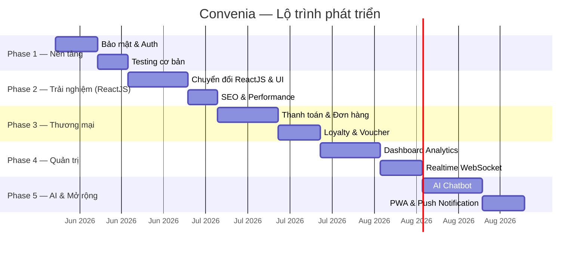

# 🚀 Kế hoạch Đường dài — Convenia Website

> **Tầm nhìn:** Biến Convenia từ một đồ án sinh viên thành một nền tảng thương mại điện tử chuỗi cửa hàng tiện lợi có kiến trúc chuyên nghiệp, lấy cảm hứng từ các thương hiệu hàng đầu thế giới.

---

## 📊 Hiện trạng dự án (Baseline)

### Những gì đã có ✅
| Hạng mục | Chi tiết |
|---|---|
| **Frontend** | HTML/CSS/JS modules, Dark/Light theme, Responsive |
| **Backend** | FastAPI (Python) + PostgreSQL (Supabase) |
| **Auth** | Email/Password + FIDO2/WebAuthn + 2FA |
| **Tính năng** | Flash Sale, Giỏ hàng, Đặt hàng, Quản lý kho, Đa chi nhánh |
| **i18n** | Đa ngôn ngữ (VI/EN/KR) với MutationObserver |
| **Admin** | CRUD sản phẩm, Nhật ký kho, Cấu hình Flash Sale |
| **Bảo mật** | Hashing bcrypt, JWT Cookie, CSP, CORS an toàn & Rate Limiting |
| **Testing** | Unit tests cơ bản (Auth, Products) |

### Những gì thiếu ❌
- CI/CD: Không có pipeline tự động
- Analytics: Không có dashboard thống kê
- UX nâng cao: Không có animations, loading skeleton, search nâng cao
- SEO: Chưa tối ưu meta tags, structured data

---

## 🗺️ Lộ trình 5 Giai đoạn



---

## Phase 1: Nền tảng Bảo mật & Chất lượng (~2 tuần)

> **Cảm hứng:** Mọi thương hiệu lớn (Dior, Apple, Shopee) đều đặt bảo mật là nền tảng số 1.

### 1.1 Hash mật khẩu với bcrypt

#### [MODIFY] [main.py](file:///c:/Convenia-Store/backend/main.py)
- [x] Thêm `bcrypt` vào dependencies
- [x] Hash password khi đăng ký: `bcrypt.hashpw(password, bcrypt.gensalt())`
- [x] Verify password khi đăng nhập: `bcrypt.checkpw(password, hashed)`
- [x] Migration script để hash tất cả password hiện tại trong DB

#### [MODIFY] [requirements.txt](file:///c:/Convenia-Store/backend/requirements.txt)
- [x] Thêm `bcrypt>=4.0.0`

### 1.2 JWT Token Authentication & XSS Defense

#### [NEW] `backend/auth_utils.py`
- [x] Tạo module `auth_utils.py` chứa:
  - [x] `create_access_token(uid, role)` → JWT access token (hết hạn cực ngắn: 5 phút)
  - [x] `create_refresh_token(uid)` → JWT refresh token (hết hạn 7 ngày)
  - [x] `verify_token(token)` → decode và validate token
  - [x] `require_admin(token)` → middleware kiểm tra quyền admin

#### [MODIFY] [main.py] & CSP (Phòng thủ XSS)
- [x] Trả về `access_token` qua body để Frontend lưu vào **`localStorage`**.
- [x] Trả về `refresh_token` qua **HTTP-Only Cookies** (ẩn với JavaScript để hacker không thể lấy).
- [x] Cấu hình **Content Security Policy (CSP)** trên Backend chặn toàn bộ thẻ `<script src="...">` đến từ các trang web lạ. Sử dụng thuộc tính `integrity` (SRI) khi nhúng CDN.

#### [MODIFY] React Context / Axios Interceptor
- [x] Lưu tạm `access_token` và Giỏ hàng (Cart) vào `localStorage`.
- [x] Nếu token trong local hết hạn, tự động gọi API làm mới bằng Refresh Token ngầm trong Cookie.

### 1.3 CORS & Rate Limiting

#### [MODIFY] [main.py](file:///c:/Convenia-Store/backend/main.py)
- [x] Thu hẹp `allow_origins` chỉ cho domain cụ thể
- [x] Thêm `slowapi` rate limiting:
  - [x] Login: 5 lần/phút
  - [x] API chung: 60 lần/phút
  - [x] Upload: 10 lần/phút

### 1.4 Unit Testing cơ bản

#### [NEW] `backend/tests/test_auth.py`
- [x] Test đăng ký, đăng nhập, token validation

#### [NEW] `backend/tests/test_products.py`
- [x] Test CRUD sản phẩm, flash sale endpoints

---

## Phase 2: Chuyển đổi ReactJS & Trải nghiệm Premium UI/UX (~3 tuần)

> **Cảm hứng từ Dior:** Giao diện sang trọng, animations tinh tế, kiến trúc Frontend hiện đại chuẩn doanh nghiệp.

### 2.1 Kiến trúc ReactJS (Vite + TailwindCSS)

#### [NEW] `frontend/` (Thư mục React mới)
- [x] Khởi tạo React App bằng **Vite**.
- [x] Thay thế toàn bộ Vanilla HTML/JS hiện tại bằng **React Components** và **React Router**.
- [x] Sử dụng **Tailwind CSS** để thiết kế giao diện nhanh, dễ bảo trì và responsive hoàn hảo.
- [x] Quản lý trạng thái (Auth, Cart) bằng **React Context**, kết hợp sao lưu xuống `localStorage` để dữ liệu không mất khi F5.

### 2.2 Animations cao cấp với Framer Motion

#### [NEW] Thư viện `framer-motion`
- [x] Tích hợp `framer-motion` để tạo các chuyển động mượt mà như native app.
- [x] **Page transitions:** Hiệu ứng fade/slide khi chuyển trang (React Router).
- [x] **Scroll animations:** Khung xương loading (Skeleton) và hiệu ứng bay lên (stagger) khi cuộn xem danh sách sản phẩm.
- [x] **Interactive hover:** Nút bấm và thẻ sản phẩm có hiệu ứng nảy nhẹ (spring), phát sáng viền.

### 2.2 Tìm kiếm nâng cao

#### [NEW] `html/search.html`
- [x] Trang tìm kiếm riêng biệt với:
  - [x] **Instant search** (gợi ý realtime khi gõ)
  - [x] **Bộ lọc**: Giá (range slider), Loại sản phẩm, Chi nhánh
  - [x] **Sắp xếp**: Giá tăng/giảm, Tên A-Z, Mới nhất
  - [x] **Lịch sử tìm kiếm** gần đây

#### [MODIFY] [main.py](file:///c:/Convenia-Store/backend/main.py)
- [ ] Thêm endpoint `GET /api/products/search?q=...&min_price=...&max_price=...&sort=...`
- [ ] Full-text search trên PostgreSQL (sử dụng `tsvector`)

### 2.3 Product Detail Page

#### [NEW] `html/product.html`
- [x] Trang chi tiết sản phẩm riêng (như Dior có trang riêng cho từng sản phẩm):
  - [x] Hình ảnh lớn + Gallery zoom
  - [x] Mô tả chi tiết, thông tin dinh dưỡng
  - [x] Sản phẩm liên quan (gợi ý)
  - [x] Nút "Thêm vào giỏ" nổi bật
  - [ ] Đánh giá & bình luận (Phase 3)

### 2.4 SEO & Performance

#### [MODIFY] Tất cả file HTML
- [x] Thêm `<meta name="description">`, `<meta property="og:...">` cho mỗi trang
- [x] Structured Data (JSON-LD) cho sản phẩm (`Product` schema)
- [x] Lazy loading cho hình ảnh (`loading="lazy"`)
- [x] Minify CSS/JS cho production

---

## Phase 3: Thương mại Chuyên nghiệp (~2-3 tuần)

> **Cảm hứng từ Shopee/Lazada:** Gamification, voucher system, loyalty program. **7-Eleven:** Convenience-first, scan & go.

### 3.1 Hệ thống Thanh toán

#### [NEW] `html/checkout.html`
- Trang checkout riêng biệt với các bước rõ ràng:
  1. **Thông tin giao hàng** (địa chỉ, số điện thoại)
  2. **Phương thức thanh toán**: COD, Chuyển khoản ngân hàng, (tích hợp VNPay/MoMo sau)
  3. **Xác nhận đơn hàng** (review giỏ hàng)
  4. **Hoàn tất** (mã đơn hàng + thông báo thành công)

#### [MODIFY] [main.py](file:///c:/Users/ACER/Documents/CK/Convenia-Website/backend/main.py)
- [ ] Thêm trạng thái đơn hàng chi tiết: `Chờ xác nhận → Đang chuẩn bị → Đang giao → Hoàn tất → Đã hủy`
- [ ] API cập nhật trạng thái đơn hàng (cho admin)
- [x] API lấy chi tiết 1 đơn hàng

### 3.2 Hệ thống Voucher & Mã giảm giá

#### [NEW] Bảng DB `vouchers`
```sql
CREATE TABLE vouchers (
  id UUID PRIMARY KEY,
  code VARCHAR(50) UNIQUE NOT NULL,
  type VARCHAR(20), -- 'percent' hoặc 'fixed'
  value DECIMAL(10,2),
  min_order DECIMAL(10,2),
  max_discount DECIMAL(10,2),
  usage_limit INTEGER,
  used_count INTEGER DEFAULT 0,
  start_date TIMESTAMP,
  end_date TIMESTAMP,
  is_active BOOLEAN DEFAULT TRUE
);
```
- [ ] Admin có thể tạo, sửa, xóa voucher
- [x] Khách nhập mã giảm giá ở trang checkout
- [ ] Validate: hạn dùng, giới hạn lượt, đơn tối thiểu

### 3.3 Loyalty Program (Tích điểm)

#### [NEW] Bảng DB `loyalty_points`
- Mỗi đơn hàng tích điểm (1.000đ = 1 điểm)
- Đổi điểm lấy voucher
- Hiển thị số điểm trên header và trang profile
- Bảng xếp hạng thành viên: Đồng → Bạc → Vàng → Kim cương

### 3.4 Đánh giá & Bình luận sản phẩm

#### [NEW] Bảng DB `reviews`
- Khách hàng đánh giá sản phẩm (1-5 sao + nhận xét)
- Hiển thị rating trung bình trên card sản phẩm
- Admin có thể duyệt/ẩn bình luận

---

## Phase 4: Quản trị & Real-time (~2-3 tuần)

> **Cảm hứng từ Shopify/Dior Backend:** Dashboard thống kê trực quan, quản trị mạnh mẽ. **Cảm hứng từ Grab:** Real-time tracking.

### 4.1 Admin Dashboard Analytics

#### [NEW] `html/dashboard.html`
- **Tổng quan kinh doanh** (số đơn hôm nay, doanh thu, sản phẩm bán chạy)
- **Biểu đồ doanh thu** theo ngày/tuần/tháng (Chart.js hoặc ApexCharts)
- **Top sản phẩm bán chạy** (bar chart)
- **Phân bổ đơn hàng** theo chi nhánh (pie chart)
- **Khách hàng mới** theo thời gian (line chart)

#### [MODIFY] [main.py](file:///c:/Users/ACER/Documents/CK/Convenia-Website/backend/main.py)
- Thêm các endpoint analytics:
  - `GET /api/analytics/revenue?period=daily|weekly|monthly`
  - `GET /api/analytics/top-products?limit=10`
  - `GET /api/analytics/orders-by-branch`
  - `GET /api/analytics/new-customers`

### 4.2 Phân quyền chi tiết (RBAC)

- **Super Admin**: Toàn quyền hệ thống
- **Store Manager**: Quản lý kho + Flash Sale của chi nhánh mình
- **Staff**: Chỉ xem kho, xử lý đơn hàng
- **Customer**: Mua hàng, đánh giá

### 4.3 WebSocket Real-time

#### [NEW] `backend/websocket.py`
- **Đồng hồ đếm ngược Flash Sale** đồng bộ tất cả client
- **Thông báo đơn hàng mới** cho Admin (real-time push)
- **Cập nhật tồn kho** live (khi có người mua, số lượng giảm ngay lập tức)
- **Chat hỗ trợ khách hàng** (Admin ↔ Khách)

### 4.4 Nhật ký hoạt động (Audit Log)

#### [NEW] Bảng DB `audit_logs`
- [x] Ghi lại mọi hành động quan trọng: ai làm gì, lúc nào, IP nào (nhật ký kho hàng và hành động)
- [x] Admin xem được nhật ký hoạt động toàn hệ thống (tab Nhật Ký Kho Hàng trên Admin)
- [ ] Phục vụ điều tra sự cố và tuân thủ

---

## Phase 5: AI & Mở rộng (~3-4 tuần)

> **Cảm hứng từ Dior 2026:** AI-powered "Digital Atelier" — cá nhân hóa trải nghiệm. **Shopee:** Gamification & engagement.

### 5.1 AI Chatbot Hỗ trợ Khách hàng

#### [NEW] `assets/js/chatbot.js` + `html/components/chatbot-widget.html`
- Widget chat nổi ở góc phải màn hình
- Tích hợp **Gemini API** hoặc **OpenAI API**:
  - Trả lời câu hỏi về sản phẩm, giá cả, khuyến mãi
  - Gợi ý sản phẩm dựa trên cuộc hội thoại
  - Chuyển sang nhân viên thật khi cần
- Context-aware: chatbot biết sản phẩm nào đang có, flash sale nào đang chạy

### 5.2 Gợi ý sản phẩm cá nhân hóa (Recommendation Engine)

#### [NEW] `backend/recommendations.py`
- **Collaborative filtering**: "Khách mua sản phẩm A cũng thường mua B"
- **Content-based**: Gợi ý sản phẩm cùng loại, cùng tầm giá
- Hiển thị section "Gợi ý cho bạn" trên trang chủ và trang chi tiết

### 5.3 Progressive Web App (PWA)

#### [NEW] `manifest.json` + `service-worker.js`
- Cài đặt Convenia như ứng dụng trên điện thoại
- Hoạt động offline (cache sản phẩm, giỏ hàng)
- **Push Notification**: Thông báo Flash Sale sắp bắt đầu, đơn hàng cập nhật

### 5.4 Gamification

- **Daily Check-in**: Điểm thưởng khi mở app mỗi ngày
- **Spin-to-Win**: Vòng quay may mắn (nhận voucher ngẫu nhiên)
- **Mission System**: Hoàn thành nhiệm vụ (mua 3 đơn trong tuần) → nhận thưởng

---

## 📋 Bảng so sánh Trước & Sau

| Tiêu chí | Hiện tại | Sau Phase 5 | Website tham khảo |
|---|---|---|---|
| **Bảo mật** | ⭐⭐ Plain text password | ⭐⭐⭐⭐⭐ bcrypt + JWT + RBAC | Dior, Apple |
| **UI/UX** | ⭐⭐⭐⭐ Responsive, dark mode | ⭐⭐⭐⭐⭐ Animations, skeleton, parallax | Dior, Louis Vuitton |
| **Thanh toán** | ⭐⭐ Giỏ hàng cơ bản | ⭐⭐⭐⭐⭐ Checkout flow, VNPay, voucher | Shopee, Tiki |
| **Quản trị** | ⭐⭐⭐ CRUD + kho | ⭐⭐⭐⭐⭐ Dashboard, analytics, RBAC | Shopify |
| **Real-time** | ⭐⭐⭐ Client-side countdown | ⭐⭐⭐⭐⭐ WebSocket toàn diện | Grab, Shopee |
| **AI** | ❌ Không có | ⭐⭐⭐⭐ Chatbot + Recommendation | Dior 2026, Amazon |
| **Mobile** | ⭐⭐⭐ Responsive web | ⭐⭐⭐⭐⭐ PWA + Push Notification | 7-Eleven App |
| **Testing** | ❌ Không có | ⭐⭐⭐⭐ Unit + Integration + CI/CD | Mọi dự án enterprise |

---

## ⚡ Thứ tự ưu tiên nếu thời gian hạn chế

Nếu bạn chỉ có **1-2 tháng**, tập trung vào:

1. **Phase 1 (Bảo mật)** — Bắt buộc, nền tảng cho mọi thứ
2. **Phase 2.1 (Skeleton + Animations)** — Ấn tượng thị giác lớn nhất
3. **Phase 3.1 (Checkout flow)** — Hoàn thiện luồng mua hàng
4. **Phase 4.1 (Dashboard)** — Giá trị demo cực cao

> [!IMPORTANT]
> Đây là kế hoạch tổng thể đường dài. Bạn muốn tôi bắt tay triển khai Phase nào trước? Hoặc bạn có muốn điều chỉnh thứ tự ưu tiên không?

---

## Open Questions

1. **Thời hạn nộp đồ án** là khi nào? Điều này quyết định số Phase có thể hoàn thành.
2. **Thanh toán thật** (VNPay/MoMo) có cần cho đồ án không, hay chỉ cần mock/demo?
3. **AI Chatbot** — bạn có API key của Gemini/OpenAI sẵn không, hay cần dùng giải pháp miễn phí?
4. **Domain riêng** — bạn đã có domain chưa hay chỉ dùng Render miễn phí?
